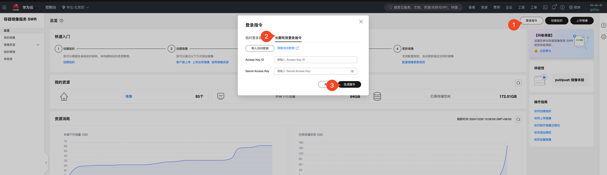
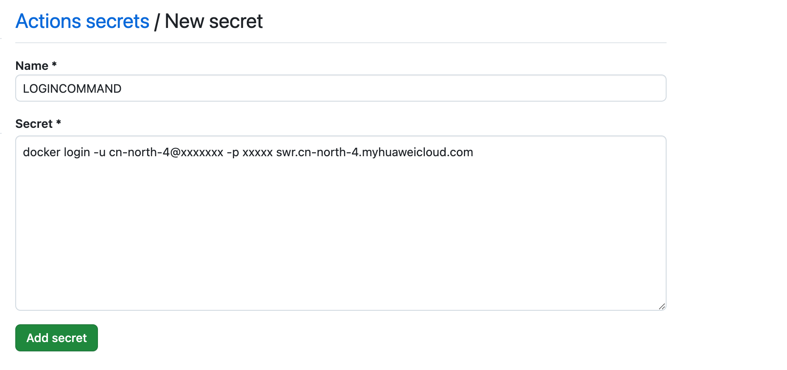
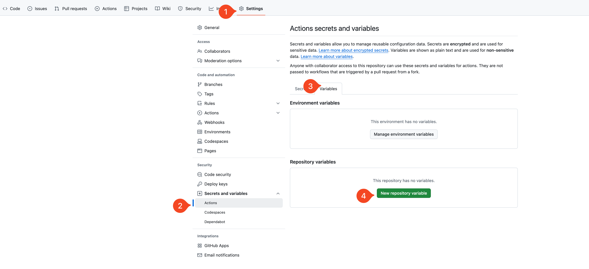
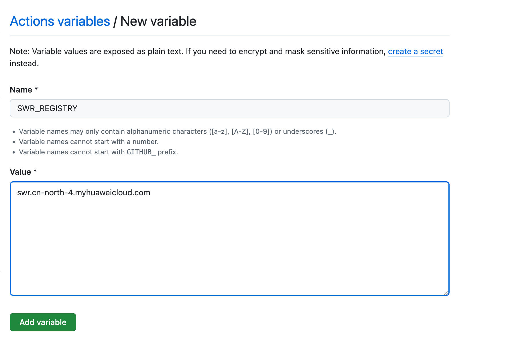
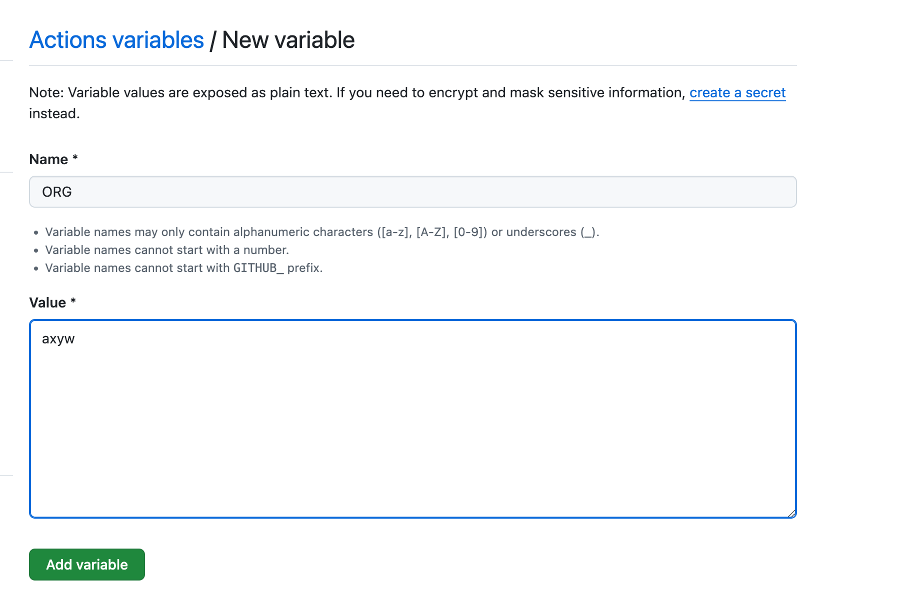
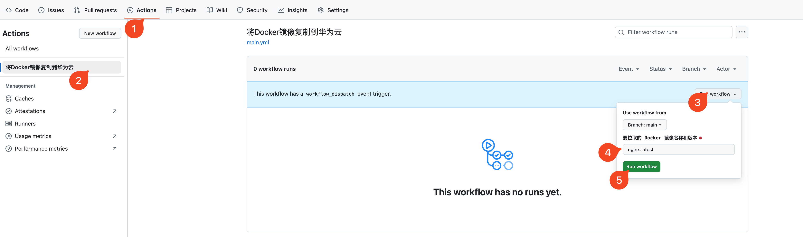
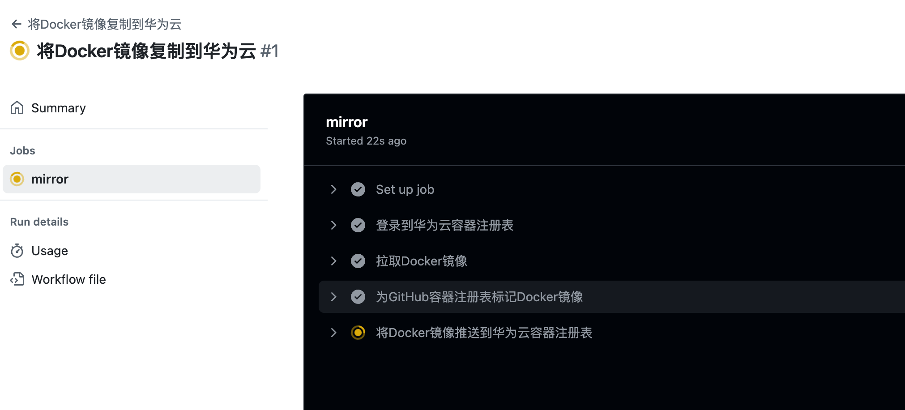
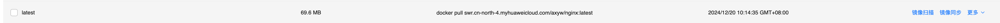

# docker2swr

把 docker 镜像发布到华为云 SWR 上 (Publish Docker images to Huawei Cloud SWR)

## 简介 (Introduction)

这个项目可以帮助你将 Docker 镜像自动发布到华为云容器镜像服务(SWR)。

This project helps you automatically publish Docker images to Huawei Cloud Software Repository for Container (SWR).

## 功能特点 (Features)

- 推送 Docker 镜像到华为云 SWR，方便国内用户使用
- 支持任何注册表的镜像，比如 DockerHub、ghcr.io。理论上 github 能拉取的都能推送过去

## 首先

克隆项目到你的 GitHub 仓库

请不要使用 Fork！因为 Fork 仓库运行 GitHub Actions 会受到运行时长限制。使用以下方法通过 Git 导入项目：

1. 点击此链接进入 GitHub 的导入页面：[GitHub 导入页面](https://github.com/new/import)
2. 在 "Your old repository’s clone URL" 一栏中输入：
   ```
   https://github.com/houxiaozhao/docker2swr.git
   ```
3. 根据提示完成项目导入。

## 使用方法 (Usage)

1. 配置 GitHub Secrets

   - 设置 `LOGINCOMMAND`: 华为云 SWR 的登录命令
   - 获取登录指令
     
   - 创建密钥
     
   - 设置密钥
     

     ```bash
     # 示例 (Example):
     docker login -u cn-north-4@xxxxxxx -p xxxxx swr.cn-north-4.myhuaweicloud.com
     ```

     > 注意：请使用你自己的登录凭证替换上述示例中的值。
     > Note: Please replace the credentials in the example with your own.

2. 配置环境变量
   

   - 设置 `SWR_REGISTRY`: 华为云 SWR 镜像仓库地址
     

     ```bash
     # 示例 (Example):
     swr.cn-north-4.myhuaweicloud.com
     ```

   - 设置 `ORG`: 华为云 SWR 组织名称
     

     ```bash
     # 示例 (Example):
     your-organization-name
     ```

3. 运行 GitHub Actions 工作流

   
   最后输入要推送的镜像名称，例如 `nginx:latest`、``

4. 等待推送完成
   
5. 查看推送结果
   去华为云的 SWR 控制台查看
   

## 环境要求 (Requirements)

- 华为云账号和 SWR 访问权限
- GitHub Actions

## Web 界面功能 (Web Interface Features)

除了通过 GitHub Actions 推送镜像，本项目还提供了一个友好的 Web 界面，方便您管理和监控镜像。

### 主要功能

1. 镜像列表查看 (Image List)

   - 显示所有已推送的镜像
   - 查看镜像标签（tags）
   - 显示更新时间
   - 支持刷新列表

2. 工作流状态监控 (Workflow Status)
   - 实时显示推送任务的执行状态
   - 自动刷新状态更新
   - 分页显示历史记录
   - 清晰的状态标识

### 使用说明

1. 访问项目的 GitHub Pages 地址
2. 输入您的 GitHub Token 进行认证
3. 配置华为云 SWR 设置

   - 在右侧面板中填写华为云 SWR 的相关信息
   - 输入 SWR API 地址（例如：`swr-api.cn-north-4.myhuaweicloud.com`）
   - 输入您的 AK（Access Key）和 SK（Secret Key）
   - 这些信息可以在华为云控制台的"我的凭证"中获取

4. 查看镜像列表

   - 配置完成后，右侧面板会显示您的 SWR 镜像列表
   - 列表显示镜像名称、标签和更新时间
   - 点击刷新按钮可以获取最新的镜像信息
   - 支持查看每个镜像的详细标签信息

5. 即可查看镜像列表和工作流状态

> 注意：Web 界面需要 GitHub Token 才能访问您的工作流信息。请确保您的 Token 具有适当的权限。
> Note: The web interface requires a GitHub Token to access your workflow information. Please ensure your token has appropriate permissions.

### 获取华为云凭证

1. 登录华为云控制台
2. 点击右上角的用户名，选择"我的凭证"
3. 在"访问密钥"页签下，可以创建或查看 AK/SK
4. 请妥善保管您的 AK/SK，不要泄露给他人

## Cloudflare Worker 代理 (Cloudflare Worker Proxy)

本项目使用 Cloudflare Worker 作为代理服务，用于处理与华为云 SWR API 的通信。这样做的主要目的是解决跨域（CORS）问题，并提供更安全的 API 访问方式。

### 功能特点

1. 跨域请求处理

   - 自动处理 CORS（跨域资源共享）请求
   - 支持预检（OPTIONS）请求
   - 允许必要的请求头和响应头

2. 安全性保障

   - 仅支持 HTTPS 协议
   - 严格的域名验证（仅允许访问华为云 SWR API 域名）
   - 请求参数验证和错误处理

3. 透明代理
   - 保持原始请求方法（GET、POST、PUT、DELETE）
   - 传递所有必要的请求头
   - 保留响应状态和内容

### 使用限制

- 仅支持 HTTPS 协议
- 仅允许访问 `swr-api.*.myhuaweicloud.com` 域名
- 需要正确编码的 URL 参数

> 注意：Worker 代理服务是 Web 界面正常运行的必要组件，无需额外配置。
> Note: The Worker proxy service is a necessary component for the web interface to function properly, no additional configuration is required.
